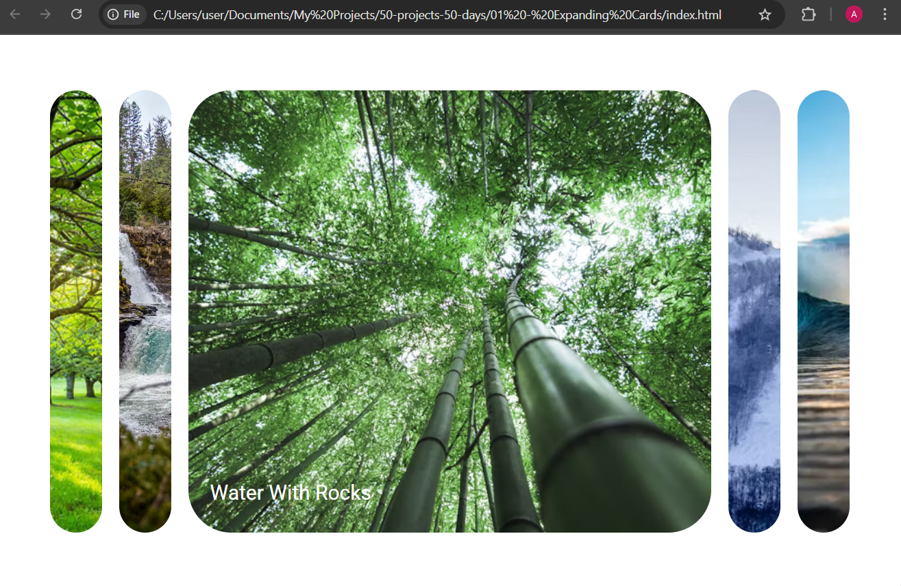

# Expanding Cards

A simple interactive UI component where clicking on a card expands it to show more focus, while collapsing the others.

---

## Screenshot

---

## What I Practiced

- How to use **flexbox** and the `flex-grow` property to create expandable elements.
- Adding/removing classes dynamically with **JavaScript**.
- Using **CSS transitions** for smooth animations.
- Combining images, text, and interactivity in a neat component.

---

## Live Demo

[View on GitHub Pages](https://Augusta08.github.io/50-projects-50-days/01-expanding-cards)