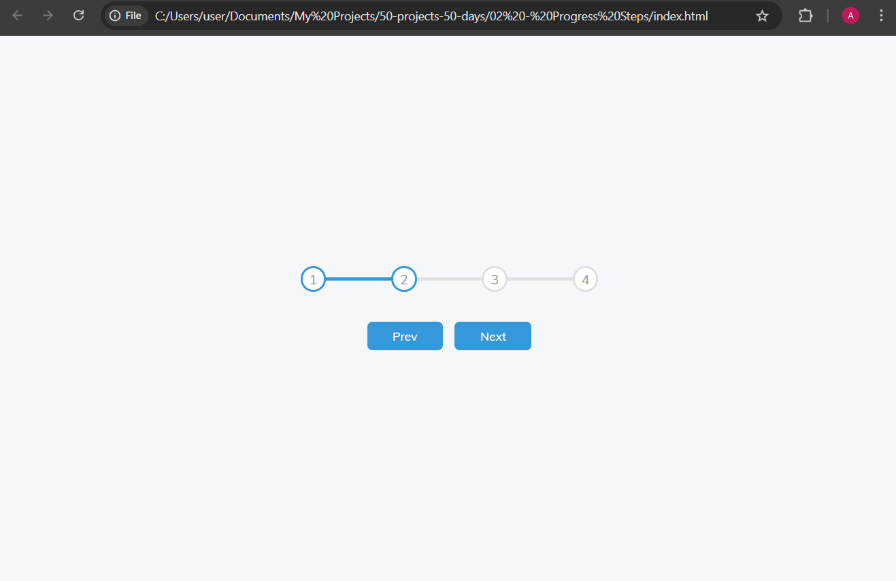

# Progress Steps

A progress tracker UI that highlights steps as you move forward or backward with next/previous buttons.

---

## Screenshot

---

## What I Learned

- Manipulating multiple elements with **querySelectorAll**.
- Dynamically adding/removing CSS classes with JavaScript.
- Using **CSS pseudo-elements** (`::before`) to create the progress bar.
- Building reusable logic for **step-by-step progress indicators**.

---

## Live Demo

[View on GitHub Pages](https://Augusta08.github.io/50-projects-50-days/02-progress-steps)
