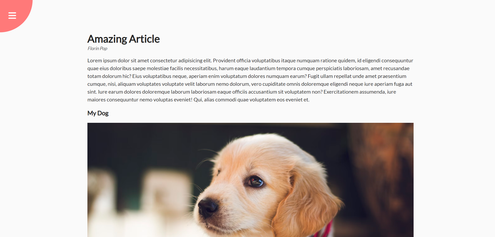
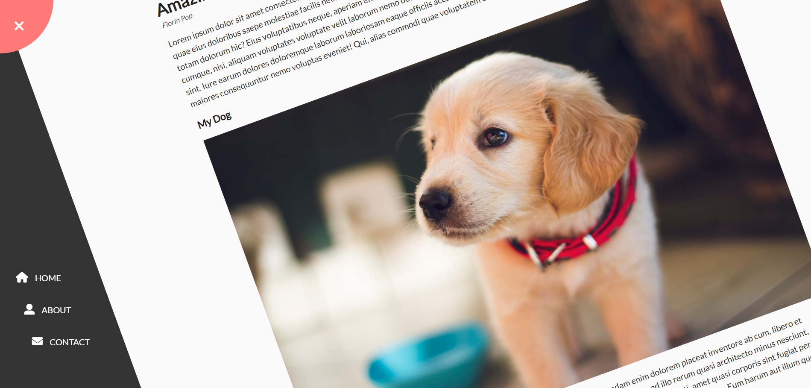

# Rotating Navigation

A navigation menu that appears with a rotating animation when you click the toggle button. The main content shifts and rotates to reveal the hidden navigation links.

## Screenshot

## What I Practiced
- Structuring HTML elements properly for layout.
- Using CSS `transform` and `transition` for smooth animations.
- Toggling classes in JavaScript to trigger the rotation effect.

## Live Demo
[View on GitHub Pages](https://augusta08.github.io/50-projects-50-days/03-rotating-navigation)
