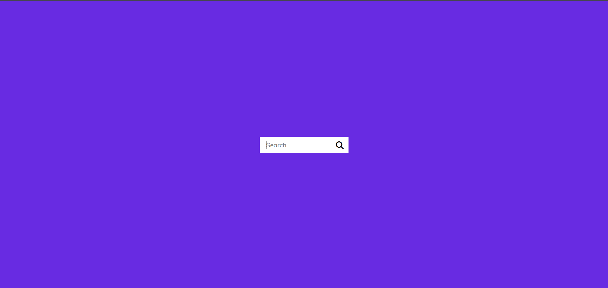

# Hidden Search Widget

A search input that expands smoothly when the search button is clicked. The input collapses back when toggled again, creating a clean and interactive widget.

## Screenshot

After clicking the search button, the input expands.

## What I Practiced

- Using `classList.toggle()` in JavaScript for interactivity.
- Applying `focus()` programmatically to an input.
- Comparing different layout approaches (flexbox vs absolute positioning).

## Live Demo

[View on GitHub Pages](https://augusta08.github.io/50-projects-50-days/04-hidden-search-widget)
