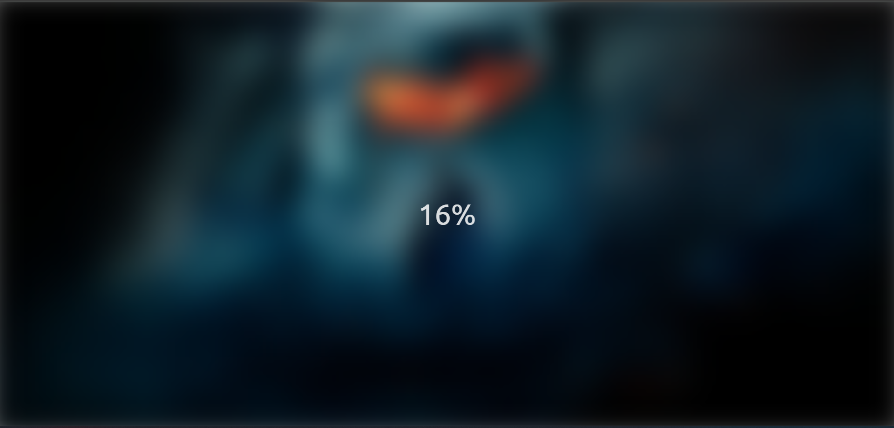

# Blurry Loading

A smooth loading animation where a blurred background image gradually becomes clear as the loading percentage increases. The transition creates a soft and visually appealing focus effect as the page loads.

## Screenshot

As the percentage increases, the blur reduces.

At 100%, the background is fully clear

## What I Learned

- Using setInterval() in JavaScript to control timing and animation updates.
- Dynamically changing CSS styles (blur and opacity) through JavaScript.
- Applying the filter: blur() property for visual transitions.
- Mapping progress values to style changes for smooth effects.

## Live Demo

[View on GitHub Pages](https://augusta08.github.io/50-projects-50-days/05-blurry-loading)
