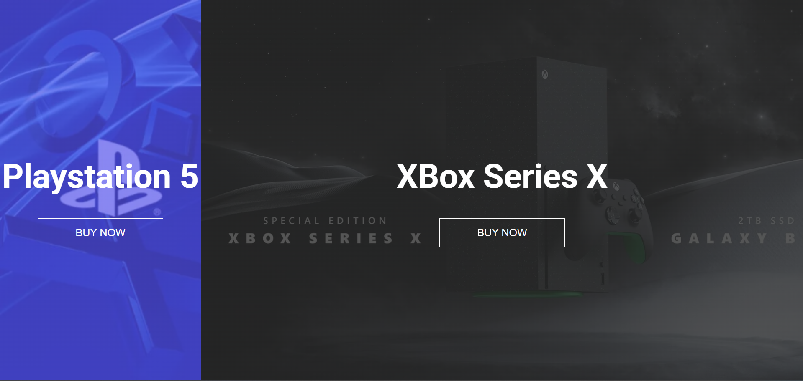

# Split Landing Page

A clean and interactive split-screen layout that expands smoothly when you hover over either side. The project presents two product sections: PlayStation 5 and Xbox Series X, with a flex-based layout and subtle overlay effects for visual contrast.

## Screenshot

When none of the sections is hovered

When the playstation section is hovered

When the XBox section is hovered

## What I Practiced

- Using Flexbox to create responsive split-screen layouts.
- Overlaying background images with semi-transparent linear gradients for better readability.
- Handling mouseenter and mouseleave events in JavaScript to toggle classes dynamically.
- Designing with multiple backgrounds in CSS.

## Live Demo

[View on GitHub Pages](https://augusta08.github.io/50-projects-50-days/07-split-landing-page)
