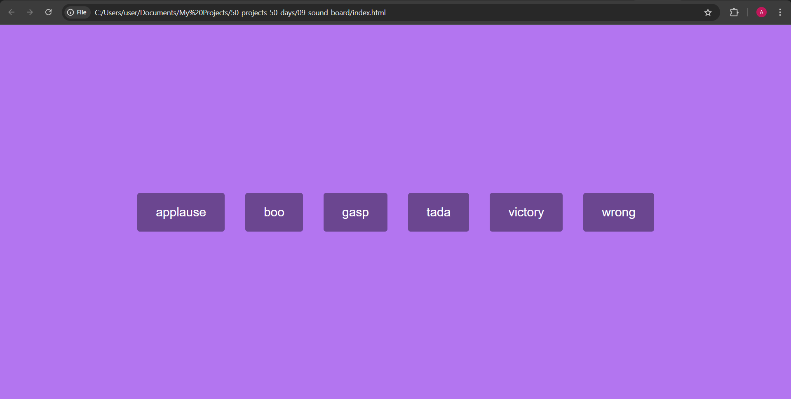

# Sound Board

A simple and fun sound board that plays different audio clips when you click the buttons. Only one sound plays at a time, creating a clean and smooth interaction without overlapping noises.

## Screenshot

## What I Practiced

- Playing and pausing audio elements dynamically with JavaScript.
- Resetting an audio clip’s playback position using currentTime.
- Managing state to prevent multiple sounds from playing at once.
- Basic layout and styling using Flexbox.

## Live Demo

[View on GitHub Pages](https://augusta08.github.io/50-projects-50-days/09-sound-board)
